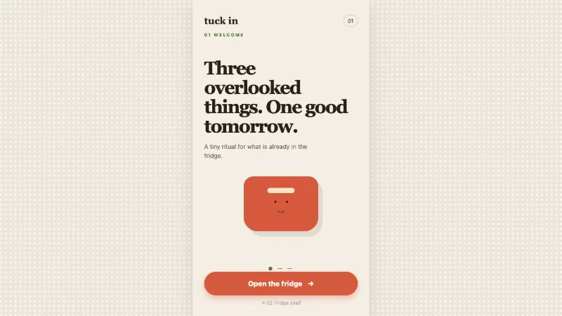
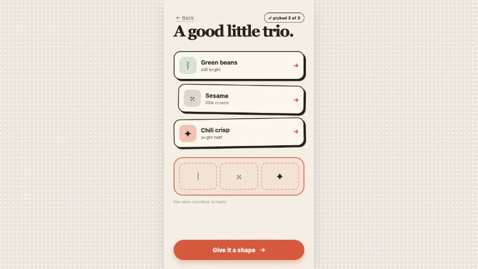
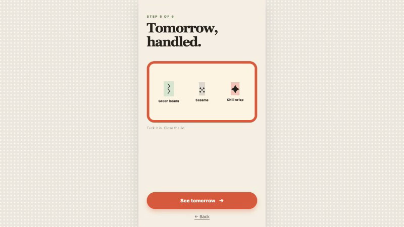

# Tuck In: Three ingredients, one easier tomorrow

<p align="center">
  
</p>

Tuck In is a six-screen ritual for turning overlooked fridge ingredients into a plan for tomorrow's lunch. Choose any three illustrated ingredients, carry the trio forward, add one gentle direction, and reveal the packed result. The interactive runtime is public and intentionally small: no accounts, storage, recipe database, or external food API.

[](https://www.typescriptlang.org/)
[](https://vite.dev/)
[](https://react.dev/)
[]()
[](LICENSE)

**Live:** [tuck-in-app.vercel.app](https://tuck-in-app.vercel.app)

---



## Live Demo

**[Open Tuck In](https://tuck-in-app.vercel.app)**

Choose three cards on the fridge shelf, continue through the board and lunchbox reveal, then restart the ritual. The complete loop runs in the browser without sign-in.

## What Is Tuck In?

Leftovers rarely fail because of a missing recipe. They get forgotten when making one more decision feels like too much. Tuck In makes that decision finite, visual, and easy to carry into tomorrow.

The original six-screen visual artifact was created in [Flowstep](https://app.flowstep.ai/prototype?activeFileId=3f9139cf-382e-4245-b1a1-aa6e238bb8ee). This React and Vite runtime provides the session-only selection state needed to carry three choices across screens. The two artifacts are linked separately so their roles stay clear.

## Screenshots

| Fridge shelf | Three-pick board |
|---|---|
|  |  |

| Lunchbox reveal |
|---|
|  |

## Features

- **Three-choice rule:** Select exactly three of six illustrated ingredients.
- **Visible progress:** The counter shows the selection moving from zero to three.
- **Carry-forward state:** The selected trio reappears in shelf order on later screens.
- **Gentle constraint:** A single direction turns the trio into an achievable next step.
- **Lunchbox payoff:** The same choices resolve into tomorrow's packed meal.
- **Clean restart:** Reset returns the ritual to the first screen with no selected cards.

## How It Works

```text
Browser
  |
  v
React application
  |
  +--> selection rules
  |      |
  |      v
  |   chosen trio in session state
  |
  +--> six-screen ritual
         |
         v
      board, constraint, lunchbox, restart
```

The runtime keeps selection state in the client. The Flowstep design source provides the visual system and original screen artifact. No user data leaves the browser.

## Tech Stack

| Layer | Technology |
|---|---|
| Visual design source | Flowstep |
| Interactive runtime | React 19 and Vite |
| Language | TypeScript |
| Tests | Vitest and Testing Library |
| Hosting | Vercel |

## Testing

The test suite covers selection limits, carry-forward behavior, navigation, restart behavior, and the six-screen journey.

```bash
npm test
# Result: 9 passing tests
```

## Try It (2 minutes)

1. Open [Tuck In](https://tuck-in-app.vercel.app).
2. Select three ingredients from the fridge shelf.
3. Continue to the board and confirm the same three cards appear.
4. Follow the constraint and open the lunchbox reveal.
5. Restart to clear the selection.

## Running Locally

```bash
git clone https://github.com/dmustapha/tuck-in.git
cd tuck-in
npm install
npm run dev
```

Open the local URL printed by Vite.

## Project Structure

```text
src/
  app/              # Screens, selection logic, and test coverage
  main.tsx          # Application entry point
public/             # Product assets
docs/images/        # Repository screenshots
```

Built for the [Flowstep Challenge](https://contra.com/community/topic/flowstepchallenge/guidelines).

## License

MIT
